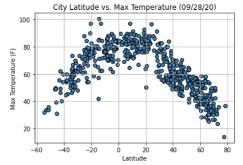
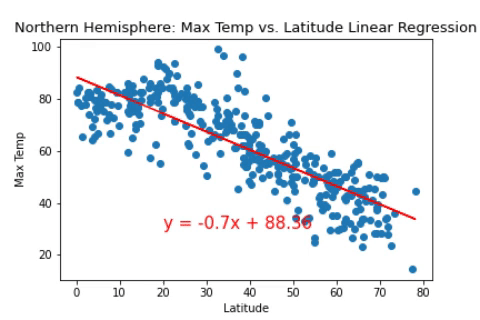
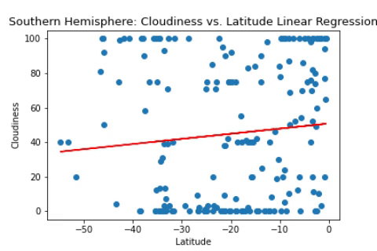
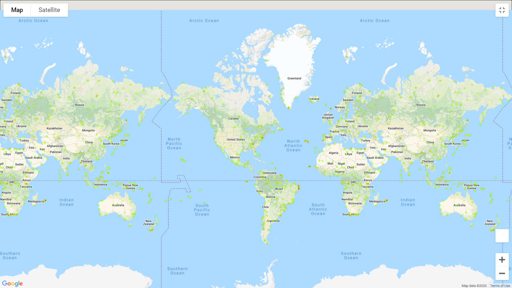
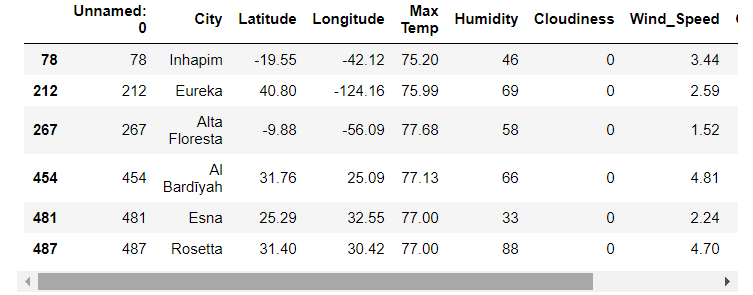
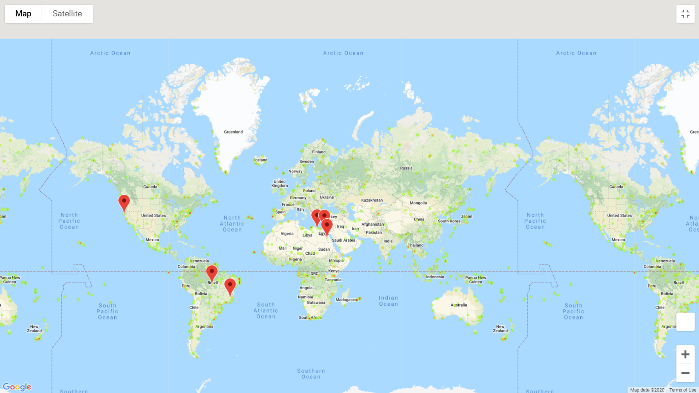

# Weather Data Analysis - API Calls

- - -

I analyzed the weather of at least 500 unique cities based on latitude and longitude using a series of successive API calls.
As well as created a heat map that displayed the humidity for every city.

- - -

## WeatherPy

#### Analysis
 * From the max temp vs latitude linear regression plots for both the northen and southern hemispheres we can infer that the closer to the equator the higher the temperature gets since latitude has a moderate relationship with temperature. This is due to the fact that the sun's rays hit the earth's surface at a higher angle at the equator.
 * From the linear regresion plots we can see that latitude has no correlation on wind speed and cloudiness. Thus no matter where you are in your latitude we are not able to tell how cloudy and how much wind speed there could be. This is because wind speed is the movement of air and cloudiness is just the measure of how much the sky is covered in clouds.
 * Although the scatter plots for humidty show that there is a weak positive relationship between latitude and humidity we can see that even though it is weak the latitude does slightly impact the humidity level. We can see that there is more humidity closer to the equator. This is true because the closer to the equator the hotter the temperature and the hotter the air is, the more water it can contain. Increasing the likeliness of water vapor and humidity.

Created a Python script to visualize the weather of 500+ cities across the world of varying distance from the equator. This was accomplished by utilizing a [simple Python library](https://pypi.python.org/pypi/citipy), and [OpenWeatherMap API](https://openweathermap.org/api).

Created a series of scatter plots to showcase the following relationships:

* Temperature (F) vs. Latitude
* Humidity (%) vs. Latitude
* Cloudiness (%) vs. Latitude
* Wind Speed (mph) vs. Latitude

Ran linear regressions on each relationship, separating them into Northern Hemisphere (greater than or equal to 0 degrees latitude) and Southern Hemisphere (less than 0 degrees latitude):

* Northern Hemisphere - Temperature (F) vs. Latitude
* Southern Hemisphere - Temperature (F) vs. Latitude
* Northern Hemisphere - Humidity (%) vs. Latitude
* Southern Hemisphere - Humidity (%) vs. Latitude
* Northern Hemisphere - Cloudiness (%) vs. Latitude
* Southern Hemisphere - Cloudiness (%) vs. Latitude
* Northern Hemisphere - Wind Speed (mph) vs. Latitude
* Southern Hemisphere - Wind Speed (mph) vs. Latitude

### VacationPy

I used jupyter-gmaps and the Google Places API to:

* Create a heat map that displays the humidity for every city from the WeatherPy

* Narrowed down the DataFrame to find the ideal weather condition. For example:

  * A max temperature lower than 80 degrees but higher than 75.

  * Wind speed less than 5 mph.

  * Zero cloudiness.

  * Drop any rows that don't contain all three conditions.

* Used Google Places API to find the first hotel for each city located within 5000 meters of the coordinates.

* Plotted the hotels on top of the humidity heatmap with each pin containing the **Hotel Name**, **City**, and **Country**.

- - -
The data is provided by UCSD Extension: Data Science and Visualization Bootcamp.
- - -

Contact:

Email: arcebri1@gmail.com